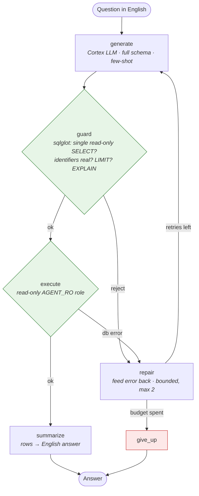
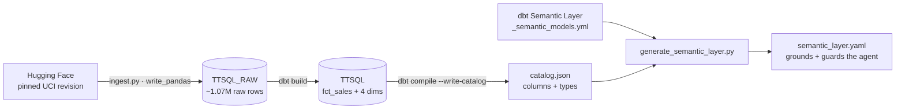

# Agentic Text-to-SQL (Snowflake + Cortex)

> Ask a business question in plain English; get an answer backed by **read-only** SQL the
> agent generated, safety-checked, and ran against a **Snowflake** warehouse — with the LLM
> running **inside** Snowflake (Cortex), full tracing, and an automated accuracy eval.

**What this proves in 60 seconds**
- **Agentic GenAI** — a multi-step **LangGraph** agent (generate → guard → execute → bounded
  repair → summarize), not a single prompt.
- **Safety by construction** — the agent can only ever *read*: a dedicated **read-only
  Snowflake role** (`AGENT_RO`) is the hard boundary, with a `sqlglot` + `EXPLAIN` guardrail
  in front of it.
- **No data leaves the warehouse** — the LLM is **Snowflake Cortex** (`COMPLETE`), called over
  the same read-only connection. No external API key, no rows shipped to a third party.
- **It refuses instead of guessing** — asked for data that doesn't exist (profit, margin, sales
  rep), it declines rather than inventing a plausible-but-wrong query.
- **It's measured, not a demo** — an **execution-accuracy** eval over a curated gold set, logged
  to **Langfuse**.
- **Real data engineering underneath** — real **UCI Online Retail II** data, modeled into a
  Kimball **star schema** with **dbt**, with the agent's semantic layer *generated* from the
  **dbt Semantic Layer** + the warehouse catalog.

## The agent workflow



The **guard sits between generation and execution** as its own node, and the **repair loop is
an explicit, bounded cycle** in the graph edges — neither is expressible inside a single LLM
call. Every node is traced to Langfuse. Full diagram: [`docs/ARCHITECTURE.md`](docs/ARCHITECTURE.md);
every trade-off: [`docs/DECISIONS.md`](docs/DECISIONS.md).

## What happens to the generated SQL

The model writes SQL as text, and that text never runs directly against the warehouse. It is
treated as untrusted and passes two checks before execution.

```
AI_COMPLETE returns SQL text
   │
_extract_sql        strip ``` fences and trailing ;            (Python)
   │
state["sql"]        store the candidate
   │
guard ─ sql_guard   parse; reject DDL/DML; every table and
   │                column must exist in the semantic layer;
   │                inject a LIMIT if missing                  (Python, no warehouse)
   │
guard ─ EXPLAIN     Snowflake validates the plan, runs nothing (Snowflake)
   │
   ├─ any error → repair → back to generate with the error fed in (bounded, max 2)
   │
execute             runs for real, returns rows                (Snowflake, AGENT_RO role)
   │
summarize           rows → English answer (AI_COMPLETE #2)      (Snowflake)
   │
END
```

The point: the model only proposes a query. The static guard catches hallucinated columns and
anything that is not a read-only SELECT. EXPLAIN confirms the plan is valid without scanning data.
The read-only `AGENT_RO` role is the wall the model can never pass. The LLM never touches the data
directly; it emits a candidate that the guards vet before it runs.

## The safety model (the headline)

| Layer | Mechanism | Can it fail open? |
|---|---|---|
| 1. Contract | prompt + few-shot: one read-only SELECT, refuse if unanswerable | yes (prompts can be bypassed) |
| 2. Guardrail | `sql_guard`: single statement, no DDL/DML, identifiers resolve to the semantic layer, LIMIT, `EXPLAIN` | yes (parser gaps) |
| 3. **DB role** | agent connects as **`AGENT_RO`** — `SELECT` + `CORTEX_USER` only, **no** write/DDL grants | **no — Snowflake rejects writes** |

An LLM emits arbitrary text, so the only trustworthy control is a **revoked privilege**. Layers
1–2 are fast, explainable filters; layer 3 is the wall. The same read-only role is what runs the
Cortex LLM — it can read and *think*, never write.

## The data

**[UCI Online Retail II](https://archive.ics.uci.edu/dataset/502/online+retail+ii)** — real
transactions from a UK-based online gift-ware retailer, **2009-12-01 → 2011-12-09**, licensed
**CC BY 4.0**. Loaded from a *pinned* Hugging Face revision (reproducible), so results don't
drift.

- **~1,067,371 raw invoice lines** → cleaned (drop cancellations, returns, non-positive
  quantity/price, blank customers) → a star schema.
- Source columns: `Invoice, StockCode, Description, Quantity, InvoiceDate, Price, Customer ID,
  Country`.
- Modeled with dbt into **`fct_sales`** (one row per invoice line; measures in **GBP**) +
  **`dim_customer`**, **`dim_product`**, **`dim_country`** (with a DACH / Europe / Rest-of-World
  region rollup), **`dim_date`**.
- All money is **GBP**. There is **no** cost, margin, or sales-rep data — which is exactly why
  the agent must *refuse* questions about them instead of fabricating an answer.



## The semantic layer is generated, not hand-maintained

The agent grounds on `data/semantic/semantic_layer.yaml` — but that file is a **generated
artifact**. `scripts/generate_semantic_layer.py` merges:
- the **dbt Semantic Layer** (`dbt/models/marts/_semantic_models.yml` — entities → keys/joins,
  measures → additivity, dimensions, grain), and
- the **warehouse catalog** (`catalog.json` — authoritative column list + types),

into the YAML the LLM reads and the guard validates against. Run `--check` as a CI gate so the
agent's grounding can never silently drift from the dbt models.

## Quickstart

Requires a Snowflake account. Credentials are read from `GENAI_DBT_SNOWFLAKE_*` env vars
(key-pair auth) — see `.env.example`.

```bash
uv sync                                              # pinned deps (Python 3.11+)

uv run python scripts/snowflake_provision.py         # create schemas + read-only AGENT_RO role
uv run python -m agentic_text_to_sql.ingest          # load pinned UCI data -> TTSQL_RAW
uv run dbt build --project-dir dbt --profiles-dir dbt # clean + model the star (+ 42 tests)

# regenerate the semantic layer from dbt + the warehouse catalog
uv run dbt compile --write-catalog --project-dir dbt --profiles-dir dbt
uv run python scripts/generate_semantic_layer.py

uv run ttsql ask "Top 5 countries by revenue in 2011"   # ask a question (Cortex)
uv run python -m agentic_text_to_sql.eval               # execution-accuracy eval
uv run uvicorn agentic_text_to_sql.api:app              # FastAPI: POST /ask {"question": "..."}
```

No Snowflake handy? The whole graph and the eval run in deterministic **mock mode**
(`LLM_PROVIDER=mock`) with no warehouse and no key — that's the CI path.

> **Inspect the agent node-by-node:** `uv run python scripts/test_nodes_step_by_step.py "Top 5
> products by revenue"` prints every node's input → output and the routing decisions.

## Deploy (public link)

The repo ships a multi-stage `Dockerfile` and a `render.yaml` blueprint. To put it on a free
public URL:

1. Build locally to check it serves: `make docker-build && make docker-run`, then open
   `http://localhost:8000` (redirects to `/docs`).
2. On [Render](https://dashboard.render.com): **New → Blueprint**, point it at this repo. It reads
   `render.yaml` and builds the `Dockerfile`.
3. Set the `GENAI_DBT_SNOWFLAKE_*` secrets in the dashboard. The private key goes in
   `GENAI_DBT_SNOWFLAKE_PRIVATE_KEY_B64` (base64 of the PEM — Render has no file mounts):
   `base64 -w0 rsa_key.p8`.
4. Open the `*.onrender.com` URL → it lands on `/docs` → run `/ask`.

The container binds `$PORT` (Render/Cloud Run) and falls back to 8000 locally. `/ask` is open in
this config, protected by the built-in rate limit and statement timeout — keep the `AGENT_RO`
warehouse extra-small with auto-suspend so a public demo can't run up cost.

## Models

The LLM is **Snowflake Cortex** (`AI_COMPLETE`), default **`mistral-large2`** (in-region, EU),
called with `temperature: 0` for deterministic SQL. Claude and other models are reachable in
Cortex via cross-region inference by changing `CORTEX_MODEL`. The only other backend is a
deterministic `MockLLM` that runs the whole graph offline with no warehouse and no key, which is
the CI and test path.

## Evaluation

Primary metric: **execution accuracy** (does the agent's result set match the reference?), plus
SQL structural similarity (diagnostic only) and retrieval correctness. Methodology + failure
modes: [`docs/DECISIONS.md`](docs/DECISIONS.md) (D6, D15). The numbers below are the deterministic
**mock baseline** (no LLM); they validate the harness, not a model. Run with `LLM_PROVIDER=cortex`
for live accuracy.

| Run | Execution accuracy | Retrieval ok-rate | Mean struct. sim |
|---|---|---|---|
| Smoke subset (mock, CI gate) | **1.00** (6/6) | 1.00 | 0.997 |
| Full set (mock baseline) | 0.33 (6/18) | 0.89 | 0.75 |

A telling case: one question scored 0.91 *structural* similarity yet **failed** execution
accuracy — exactly why structural similarity is a secondary diagnostic, never a gate.

## Tech stack

| Area | Tools |
|---|---|
| Agent | **LangGraph**, LangChain, `sqlglot` (SQL parse/guard) |
| LLM | **Snowflake Cortex** (`AI_COMPLETE`) · offline `MockLLM` for CI/tests |
| Warehouse | **Snowflake** (read-only `AGENT_RO` role; key-pair auth) |
| Modeling | **dbt** (dbt-snowflake) + **dbt Fusion** (Rust engine) · **dbt Semantic Layer** |
| Observability | **Langfuse** (per-node traces + eval scores) |
| Interfaces | **FastAPI** (`POST /ask`) · **Typer** CLI (`ttsql ask`) |
| Packaging | **Docker** (multi-stage, gunicorn) |
| Tooling | **uv**, ruff, mypy --strict, pytest, GitHub Actions |

## Repo layout

```
src/        agent graph + nodes · semantic_layer · sql_guard · read-only Snowflake client · eval · api · cli
dbt/        Kimball star + tests · _semantic_models.yml (dbt Semantic Layer)
data/       generated semantic_layer.yaml · eval gold set
scripts/    snowflake provisioning/verify · generate_semantic_layer.py · node-by-node debug harness
docs/       ARCHITECTURE.md · DECISIONS.md
tests/      pytest unit + integration
```

_Data: UCI **Online Retail II**, UCI Machine Learning Repository, **CC BY 4.0**. Loaded from a
pinned Hugging Face revision; not redistributed in this repo._
