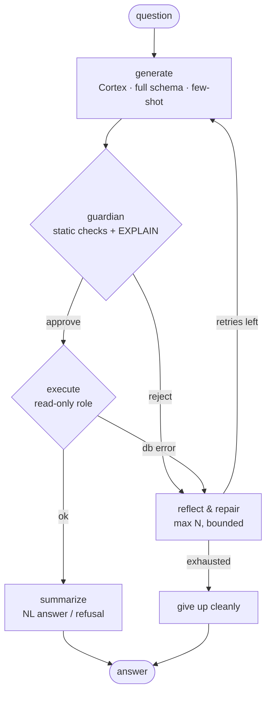
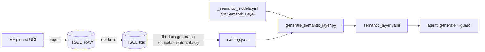

# Architecture

## One-paragraph version
A user asks a business question in natural language. A **LangGraph** agent generates Snowflake
SQL grounded in a **semantic layer** (sent in full, with few-shot examples), hands it to a
**guardrail** (static safety checks + `EXPLAIN`), executes it through a **read-only Snowflake
role**, and—on error—runs a **bounded reflect-and-repair loop** before summarizing the result in
natural language. If the schema cannot answer the question, the agent **refuses** rather than
inventing a proxy. The LLM is **Snowflake Cortex**, called over the same read-only connection, so
no data leaves the warehouse. Every node is traced in **Langfuse**, and an **evaluation harness**
scores the whole thing against a gold question set. The warehouse is the real **UCI Online Retail
II** dataset, cleaned and modeled into a **star schema** with **dbt**.

## Agent graph



There is **no classify or retrieve node**: for the fixed 5-table star, retrieval can only drop a
table the query needs, and the identifier guard (not retrieval) is what stops hallucination, so
the full schema is rendered once and sent on every generation. The **guard sits between
generation and execution** as its own node, and the **repair loop is an explicit, bounded cycle**
in the graph edges — neither is expressible inside a single LLM call.

## Layers (defense-in-depth for the read-only guarantee)
1. **Prompt / contract** — the system prompt + few-shot tell the model to emit one read-only
   SELECT and to return a `CANNOT_ANSWER` sentinel when the schema can't answer. *Can fail open.*
2. **sql_guard module + sql-guardian subagent** — sqlglot parse, single-statement, no-DDL/DML,
   identifier resolution against the semantic layer (case-insensitive), LIMIT injection, EXPLAIN.
   *Can fail open* (parser gaps).
3. **Read-only Snowflake role** — the agent connects as `AGENT_RO` with `SELECT` +
   `SNOWFLAKE.CORTEX_USER` and no write/DDL grants. *Cannot fail open* — Snowflake rejects writes
   regardless of prompt or parser. This is the real boundary; 1 and 2 are early, cheap filters.

Note the guard catches *unsafe* SQL (writes, fake columns), not *semantically wrong* SQL. A
valid query over real columns that misreads intent will pass — which is why the refusal rule and
the execution-accuracy eval exist.

## Components
| Component | Tech | Role |
|---|---|---|
| Agent graph | LangGraph + LangChain | multi-step orchestration with explicit state + edges |
| LLM | Snowflake Cortex (`COMPLETE`) | in-warehouse generation; pluggable OpenAI/Anthropic/mock |
| Semantic layer | generated YAML | grounds the generator + the guard's allowed identifiers |
| Guardrail | sqlglot + EXPLAIN | static + plan-level safety gate |
| DB access | snowflake-connector (read-only role) | only path to data; SELECT/EXPLAIN only |
| Warehouse | Snowflake | real UCI Online Retail II, star schema |
| Ingest (EL) | huggingface-hub + write_pandas | pinned download -> `TTSQL_RAW` |
| Modeling (T) | dbt-snowflake (+ dbt Fusion) | cleans raw -> star + tests (Kimball) |
| Semantic model | dbt Semantic Layer | entities/measures/dimensions/metrics -> generated semantic layer |
| Tracing | Langfuse | per-node spans, inputs/outputs, repair counts |
| Eval | custom harness | execution accuracy + struct similarity + retrieval |
| Interfaces | FastAPI + Typer CLI | `/ask` endpoint and `ttsql ask` |
| IaC | Terraform | Snowflake read-only role |

## Build pipeline (semantic layer is generated)



## Repo map
```
src/agentic_text_to_sql/   agent graph, nodes, semantic_layer, sql_guard, db (snowflake + read-only client), eval, api, cli
dbt/                       Kimball star + tests · _semantic_models.yml (dbt Semantic Layer)
data/semantic|eval/        generated semantic layer, gold set
scripts/                   snowflake provision/verify · generate_semantic_layer.py · node-by-node debug harness
terraform/snowflake/       read-only AGENT_RO role as IaC
tests/                     pytest unit + integration
.claude/                   settings (permissions), subagents, skills
docs/                      this file + DECISIONS.md
```
