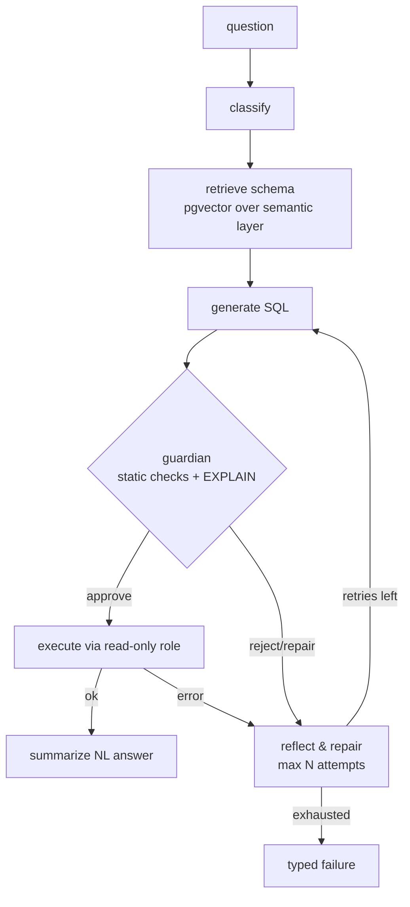

# Architecture

## One-paragraph version
A user asks a business question in natural language. A **LangGraph** agent classifies it,
retrieves the relevant slice of a **semantic layer** (table/column descriptions over
**pgvector**), generates Postgres SQL, hands it to a **guardrail** (static safety checks +
`EXPLAIN`), executes it through a **read-only Postgres role**, and—on error—runs a
**bounded reflect-and-repair loop** before summarizing the result in natural language.
Every node is traced in **Langfuse**, and an **evaluation harness** scores the whole thing
against a gold question set. The warehouse itself is the real **UCI Online Retail II**
dataset (UK/EU e-commerce invoices), cleaned and modeled into a **star schema** with **dbt**.

## Agent graph

```
            ┌─────────────┐
  question  │  classify   │   what kind of question? (lookup/aggregate/trend/ambiguous)
  ───────▶  └──────┬──────┘
                   ▼
            ┌─────────────┐
            │  retrieve   │   pull relevant tables/cols from the semantic layer (pgvector)
            │   schema    │   → keeps the model from hallucinating columns
            └──────┬──────┘
                   ▼
            ┌─────────────┐
            │  generate   │   LLM writes ONE parameterized SELECT, grounded in retrieved schema
            │    SQL      │
            └──────┬──────┘
                   ▼
            ┌─────────────┐   sqlglot static checks: single stmt, read-only, identifiers
            │  guardian   │   resolve, LIMIT present; then EXPLAIN (not ANALYZE).
            │ validate +  │   ── reject/repair ──┐
            │  EXPLAIN    │                      │
            └──────┬──────┘                      │
                   ▼ approve                      │
            ┌─────────────┐                       │
            │  execute    │  run via READ-ONLY role, statement timeout                     
            │ (read-only) │  ── error ───────────┤
            └──────┬──────┘                      │
                   ▼ ok                           ▼
            ┌─────────────┐            ┌────────────────────┐
            │ summarize   │            │  reflect & repair  │  feed verbatim error back,
            │ (NL answer) │            │  (max N attempts)  │  regenerate. Bounded.
            └─────────────┘            └─────────┬──────────┘
                                                 │ retries left → back to generate
                                                 │ exhausted    → typed failure
                                                 ▼
                                        ┌────────────────────┐
                                        │  give up cleanly   │
                                        └────────────────────┘
```

Mermaid (same graph, for GitHub rendering):



## Layers (defense-in-depth for the read-only guarantee)
1. **Prompt / contract** — the `sql-generation-contract` skill tells the model to emit one
   read-only SELECT. *Can fail open* (models can be jailbroken).
2. **sql_guard module + sql-guardian subagent** — sqlglot parse, single-statement,
   no-DDL/DML, identifier resolution, LIMIT injection, EXPLAIN. *Can fail open* (parser gaps).
3. **Read-only Postgres role** — the agent's DSN has no write privileges at all. *Cannot
   fail open* — the engine rejects writes regardless of prompt or parser. This is the real
   boundary; 1 and 2 are early, cheap, explainable filters in front of it.

## Components
| Component | Tech | Role |
|---|---|---|
| Agent graph | LangGraph + LangChain | multi-step orchestration with explicit state + edges |
| Semantic layer | YAML + pgvector | grounded schema the generator/guardian read |
| Guardrail | sqlglot + EXPLAIN | static + plan-level safety gate |
| DB access | psycopg (read-only role) | only path to data; SELECT/EXPLAIN only |
| Warehouse | Postgres 16 + pgvector | real UCI Online Retail II, star schema |
| Ingest (EL) | huggingface-hub + psycopg COPY | pinned download -> `raw` schema |
| Modeling (T) | dbt-postgres | cleans `raw` -> star schema + tests (Kimball) |
| Tracing | Langfuse | per-node spans, inputs/outputs, repair counts |
| Eval | custom harness | execution accuracy + struct similarity + retrieval |
| Interfaces | FastAPI + Typer CLI | /ask endpoint and `ttsql ask` |
| IaC | Terraform | local dev + documented Snowflake read-only variant |

## Repo map
```
src/agentic_text_to_sql/   agent graph, nodes, semantic_layer, sql_guard, db client, eval, api, cli
dbt/                       Kimball star schema + tests (Phase 2)
terraform/                 local dev + Snowflake read-only variant (Phase 7)
docker/initdb/             extensions + read-only role creation (runs on first DB init)
data/semantic|eval/        semantic layer, gold set (raw data loads to Postgres `raw`)
tests/                     pytest unit + integration
.claude/                   settings (permissions), subagents, skills
.mcp.json                  read-only Postgres MCP for dev introspection
docs/                      this file + DECISIONS.md
```
